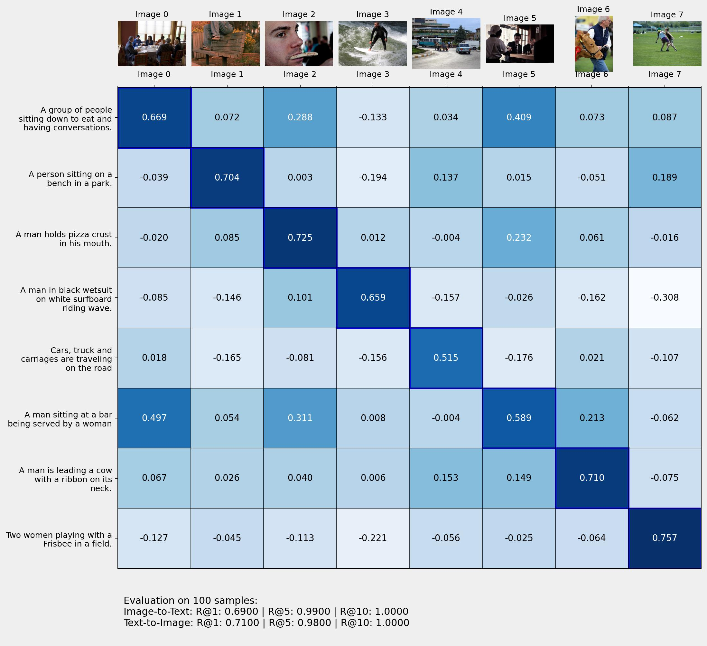
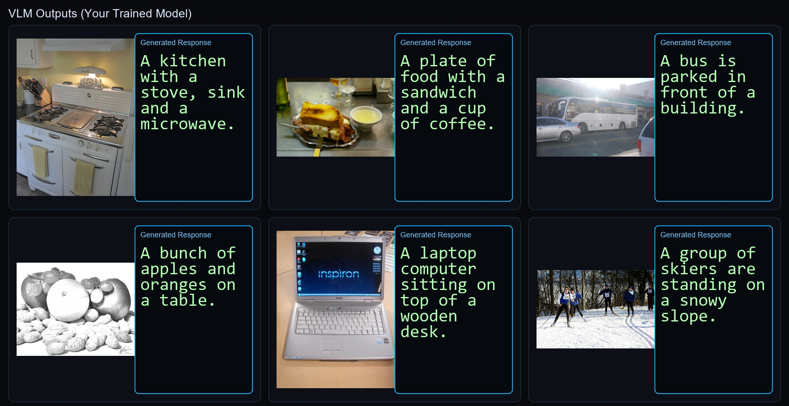

# VLM (ViT + Q-Former + SmolLM LoRA)

Two-stage vision-language training project inspired by:
`https://github.com/avbiswas/vlm/tree/main`


## Overview

Pipeline:

1. Stage 1: Train Q-Former for image-text alignment (contrastive objective)
2. Stage 2: Train VLM with LoRA on top of small LLM using Q-Former visual tokens
3. Evaluate on COCO val subset:
   - Caption metrics (BLEU/ROUGE)
   - Retrieval metrics (I2T/T2I Recall@K)

## Data

- Train subset manifest: `dataset/coco_subsets/train2017_50k.jsonl`
- Train images: `dataset/coco_subsets/train2017_50k_images`
- Eval subset manifest: `dataset/coco_subsets/val2017_1k.jsonl`
- Eval images: `dataset/coco_subsets/val2017_1k_images`

## Training Summary

### Stage 1 (Q-Former)

- GPU: RTX A5000 (24GB VRAM), 9 vCPU (RunPod)
- Epochs: 10
- Batch size: 8
- Best val loss: `0.0622` (epoch 4)

Final stage-1 artifact used:
- `models/from_pod/trained_qformer_50k_unimodal_fresh/best`

### Stage 2 (LM + LoRA)

- Base LLM: `HuggingFaceTB/SmolLM-135M-Instruct`
- Epochs: 5
- Batch size: 8
- Grad accumulation: 4
- Best val loss: `2.0672` (step 7020)
- Final epoch val loss: `2.0957`

Final stage-2 artifact used:
- `models/from_pod/vlm_peft/best`

## Final Evaluation (val subset)

### Caption metrics (500 samples, val2017 subset)

Source:
- `inference_results/val2017_500_preds.jsonl`
- `inference_results/val2017_500_metrics.json`

Results:
- BLEU: `22.4538`
- ROUGE-1: `0.4084`
- ROUGE-2: `0.1549`
- ROUGE-L: `0.3691`
- ROUGE-Lsum: `0.3690`

### Retrieval metrics (500 samples, val2017 subset)



Source:
- `inference_results/retrieval_val2017_500_metrics.json`
- `inference_results/similarity_grid.jpg`

Results:
- I2T R@1: `0.3860`
- I2T R@5: `0.8100`
- I2T R@10: `0.9300`
- T2I R@1: `0.4040`
- T2I R@5: `0.7960`
- T2I R@10: `0.9340`

## Key Commands

### Stage 1 train
```powershell
uv run -m vlm_train.qformer_train --manifest-path dataset/coco_subsets/train2017_50k.jsonl --images-dir dataset/coco_subsets/train2017_50k_images --model-id trained_qformer_50k_unimodal_fresh --epochs 10 --batch-size 8
```

### Stage 2 train
```powershell
uv run -m vlm_train.lm_train --qformer-model-path models/trained_qformer_50k_unimodal_fresh/best --manifest-path dataset/coco_subsets/train2017_50k.jsonl --images-dir dataset/coco_subsets/train2017_50k_images --model-id vlm_peft --epochs 5 --batch-size 8
```

### Single-image inference
```powershell
uv run -m vlm_train.basic_inf --image "dataset/coco_subsets/train2017_50k_images/<image>.jpg" --checkpoint-dir "models/from_pod/vlm_peft/best" --qformer-model-path "models/from_pod/trained_qformer_50k_unimodal_fresh/best"
```


### Batch caption inference + metrics (500)
```powershell
uv run -m vlm_train.batch_inf --num-samples 500 --manifest-path "dataset/coco_subsets/val2017_1k.jsonl" --images-dir "dataset/coco_subsets/val2017_1k_images" --checkpoint-dir "models/from_pod/vlm_peft/best" --qformer-model-path "models/from_pod/trained_qformer_50k_unimodal_fresh/best" --out-path "inference_results/val2017_500_preds.jsonl"

uv run -m vlm_train.eval_captions --preds-jsonl "inference_results/val2017_500_preds.jsonl" --out-json "inference_results/val2017_500_metrics.json" --out-csv "inference_results/val2017_500_metrics_per_sample.csv" --skip-bertscore
```

### Retrieval eval (500)
```powershell
uv run -m vlm_train.retrieval_eval --num-samples 500 --manifest-path "dataset/coco_subsets/val2017_1k.jsonl" --images-dir "dataset/coco_subsets/val2017_1k_images" --qformer-path "models/from_pod/trained_qformer_50k_unimodal_fresh/best" --out-json "inference_results/retrieval_val2017_500_metrics.json" --save-grid --grid-path "inference_results/similarity_grid.jpg"
```
